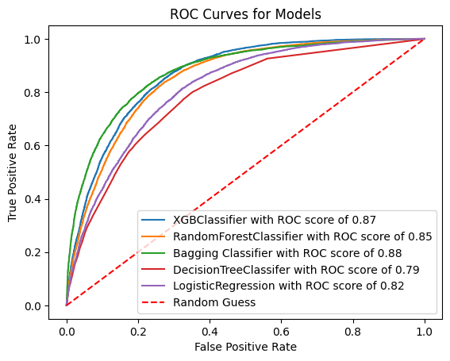
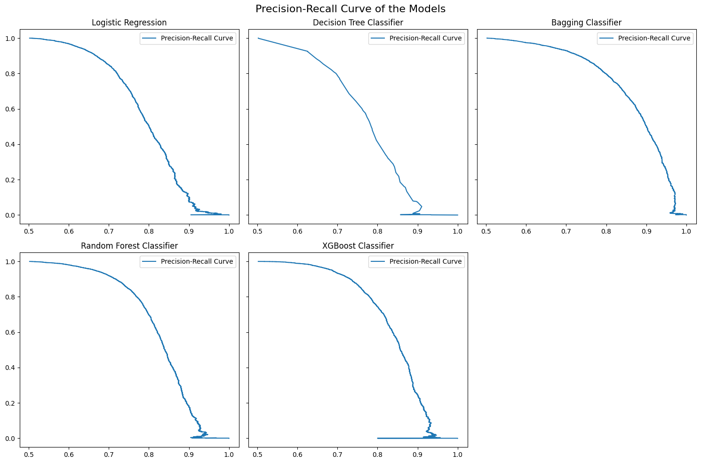

# CARDIO VASCULAR DISEASE PREDICTOR 
## Welcome to the ML-Powered Web application that helps you to predict the risk of developing the cardiovascular disease from your daily habits and lifestyle indicators. The whole purpose of this project is to analyze the relation between the data science and health sector.
> ⚠️ **Note**: This app is purely made for educational purpose. Please do not use it for your clinical and diagnostic reasons.
---
## Features of the app 
- You can easily input the data through the sliders and checkboxes, the UI is pretty simple and straightforward.
- Prediction of cardiovascular disease likelihood using machine learning
- The five most commonly used models has been trained, tested, hypertuned, and compared to find the right pick which works perfectly in the realtime data.
- Different evaluation metrics: precision, accuracy, recall, roc_auc_score, and precision_recall curve has been used to compare the model's performance.
- Clean UI, Developer Info, and Disclaimers are taken as the pre-dominant consideration.

## Technologies Used

| Category        | Stack / Tools Used |
|-----------------|--------------------|
| **Frontend**    | Streamlit          |
| **Backend**     | Python (scikit-learn, pandas, joblib) |
| **Visualization** | Matplotlib / Embedded PNGs / Seaborn |
| **Deployment**  | Streamlit cloud 

---

## Project Structure 

CARDIOVASCULAR_PROJECT/
│
├── app/
│   ├── app.py
│   ├── rocauc.png
│   └── precisionrecall.png
│
├── data_cleaning/
│   ├── cardiovascular.csv
│   ├── cleaned.csv
│   └── cleaningDataset.ipynb
│
├── EDA/
│   ├── cleaned.csv
│   └── EDA.ipynb
│
├── modelPreparation/
│   ├── dataforModel.ipynb
│   ├── forModel.csv
│   ├── model.ipynb
│   └── model.pkl
│
└── README.md


---

## 🧪 Machine Learning Models Compared

| Model                    | Accuracy | Precision | Recall |
|--------------------------|----------|-----------|--------|
| Logistic Regression      | 74%      | 71%       | 73%    |
| Decision Tree            | 73%      | 75%       | 61%    |
| **Bagging Classifier** ✅| **80%**  | **84%**   | **74%**|
| Random Forest            | 79%      | 82%       | 71%    |
| XGBoost                  | 79%      | 82%       | 74%    |

*The Bagging Classifier outperformed all others and was selected for prediction in the app.*

---


## 📈 Model Evaluation Visuals

- ROC-AUC Curve 
- Precision-Recall Curve 

---

## ⚙️ How to Run Locally

1. Clone this repository:
   ```bash
   git clone https://github.com/suzaladhikari/CardioRiskPredictor.git
   cd CardioRiskPredictor

## Install required packages
  ```bash
  pip install -r requirements.txt

## Run the app
streamlit run app.py
