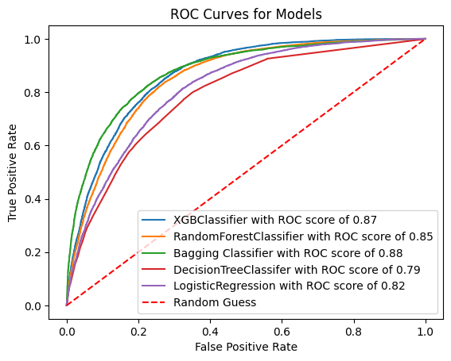
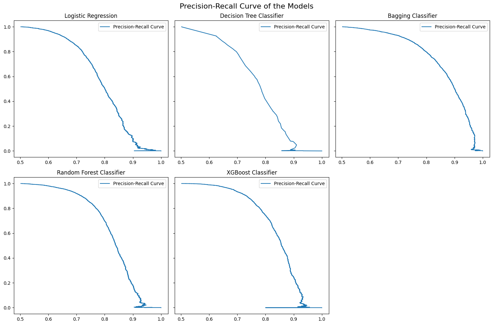

# CARDIO VASCULAR DISEASE PREDICTOR 
## Welcome to the ML-Powered Web application that helps you to predict the risk of developing the cardiovascular disease from your daily habits and lifestyle indicators. The whole purpose of this project is to analyze the relation between the data science and health sector.
> ⚠️ **Note**: This app is purely made for educational purpose. Please do not use it for your clinical and diagnostic reasons.
---
## Features of the app 
- You can easily input the data through the sliders and checkboxes, the UI is pretty simple and straightforward.
- Prediction of cardiovascular disease likelihood using machine learning
- The five most commonly used models has been trained, tested, hypertuned, and compared to find the right pick which works perfectly in the realtime data.
- Different evaluation metrics: precision, accuracy, recall, roc_auc_score, and precision_recall curve has been used to compare the model's performance.
- Clean UI, Developer Info, and Disclaimers are taken as the pre-dominant consideration.

## Technologies Used

| Category        | Stack / Tools Used |
|-----------------|--------------------|
| **Frontend**    | Streamlit          |
| **Backend**     | Python (scikit-learn, pandas, joblib) |
| **Visualization** | Matplotlib / Embedded PNGs / Seaborn |
| **Deployment**  | Streamlit cloud 

---

## 📁 Project Structure

```
CARDIOVASCULAR_PROJECT/
│
├── app/
│   ├── app.py                   # Streamlit web app
│   ├── rocauc.png               # ROC-AUC curve image
│   └── precisionrecall.png      # Precision-Recall curve image
│
├── data_cleaning/
│   ├── cardiovascular.csv       # Raw dataset
│   ├── cleaned.csv              # Cleaned dataset after preprocessing
│   └── cleaningDataset.ipynb    # Notebook for data cleaning
│
├── EDA/
│   ├── cleaned.csv              # Input dataset for EDA
│   └── EDA.ipynb                # Exploratory data analysis notebook
│
├── modelPreparation/
│   ├── dataforModel.ipynb       # Feature engineering notebook
│   ├── forModel.csv             # Final dataset ready for model training
│   ├── model.ipynb              # Model training & evaluation
│   └── model.pkl                # Best performing model (Bagging Classifier)
│
└── README.md                    # Project documentation (this file)
```

## 🧪 Machine Learning Models Compared

| Model                    | Accuracy | Precision | Recall |
|--------------------------|----------|-----------|--------|
| Logistic Regression      | 74%      | 71%       | 73%    |
| Decision Tree            | 73%      | 75%       | 61%    |
| **Bagging Classifier** ✅| **80%**  | **84%**   | **74%**|
| Random Forest            | 79%      | 82%       | 71%    |
| XGBoost                  | 79%      | 82%       | 74%    |

*The Bagging Classifier outperformed all others and was selected for prediction in the app.*

---


## 📈 Model Evaluation Visuals

- ROC-AUC Curve 
- Precision-Recall Curve 

---

## ⚙️ How to Run Locally

1. Clone this repository:
   ```bash
   git clone https://github.com/suzaladhikari/CardioRiskPredictor.git
   cd CardioRiskPredictor

## Install required packages
   `pip install -r requirements.txt`

## Learnings from the Project

- Built a full-cycle machine learning pipeline — from data cleaning, EDA, and hypothesis testing to feature engineering, model selection, and deployment.

- Performed exploratory data analysis (EDA) to uncover trends, outliers, and correlations in lifestyle and health factors.

- Conducted hypothesis testing to validate assumptions and guide feature selection.

- Compared multiple classification models and evaluated them using precision-recall curves, ROC-AUC, and key performance metrics.

- Developed a clean, interactive Streamlit web application to make the ML model accessible and informative for end users.

- Gained hands-on experience with industry-standard tools like pandas, NumPy, scikit-learn, and Streamlit.

> ⚠️ **Note**: This application is not trained on actual clinical data and is intended solely for educational purposes. It must not be used for any medical decisions or diagnoses. Always consult a licensed professional for health concerns.


